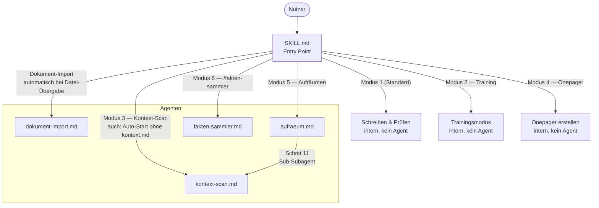
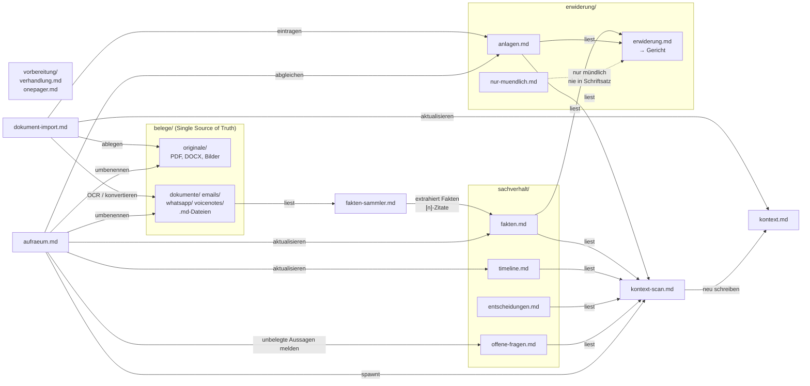
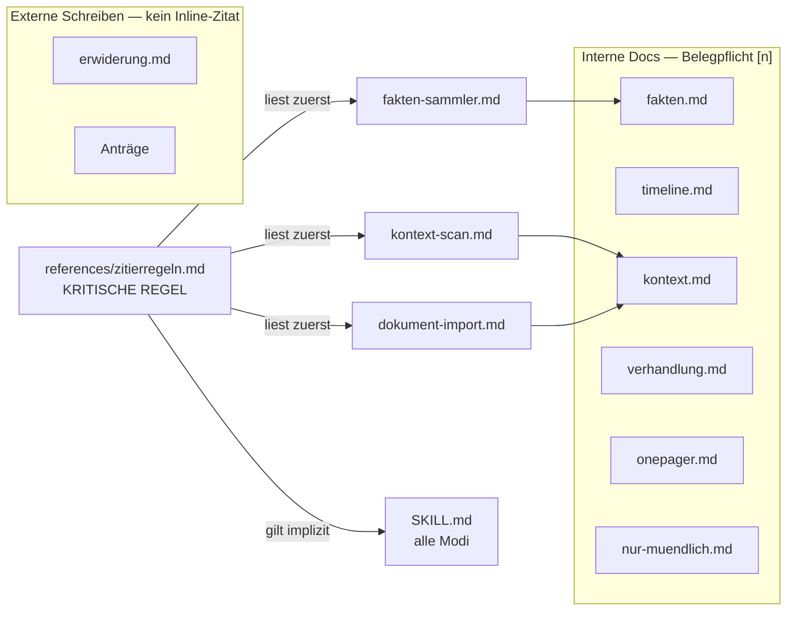
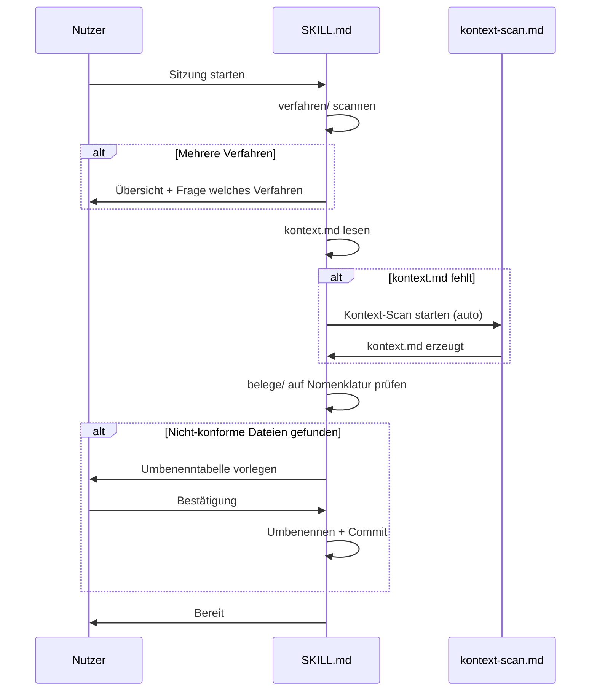

# Architektur — Familienrecht-Skill

## Überblick

Der Skill ist ein Claude-Code-Skill (Markdown-basierte Instruktionsdatei) mit einer agentenbasierten Architektur. Die zentrale Steuerdatei `SKILL.md` definiert 6 Modi und delegiert komplexe Aufgaben an spezialisierte Sub-Agenten. Alle persistenten Daten liegen im Verfahrensordner (`verfahren/{az-kurz}/`), der durch `setup-verfahren.sh` erzeugt wird.

---

## Verzeichnisstruktur Skill

```
skills/familienrecht/
├── SKILL.md                        ← Haupt-Instruktionsdatei (Entry Point)
├── agents/
│   ├── dokument-import.md          ← Agent: Einzeldokument importieren
│   ├── kontext-scan.md             ← Agent: kontext.md neu aufbauen
│   ├── aufraeum.md                 ← Agent: Verfahrensordner bereinigen
│   └── fakten-sammler.md           ← Agent: Fakten aus Belegen extrahieren
├── references/                     ← Fachliche Referenzen (read-only)
│   ├── zitierregeln.md             ← Belegpflicht-Format (KRITISCH)
│   ├── cochemer-modell.md          ← Ton & Strategie für Schriftsätze
│   ├── dateinamenskonvention.md    ← YYYYMMDD_AZ_VON_AN_Beschreibung
│   ├── workflow.md                 ← 5-Phasen-Workflow Detail
│   ├── pruefschema.md              ← Schriftsatz-Prüfcheckliste
│   ├── formatierung.md             ← PDF/DOCX-Formatregeln
│   ├── betreuungsmodelle.md        ← Modelle + Gesprächsfragen
│   ├── trainingsmodus.md           ← Rollenbeschreibungen Training
│   ├── verhaltensregeln.md         ← Do's & Don'ts Gericht/JA/VB
│   ├── verfahrensbeistand.md       ← 20 typische VB-Fragen + Logik
│   ├── kalender.md                 ← Kalender-Format & Legende
│   └── loop-sachverhalt.md         ← Loop-Modus Detail
├── assets/verfahren/               ← Templates (niemals direkt bearbeiten)
│   ├── .claudeprompt/CLAUDE.md     ← Auto-Kontext-Template
│   ├── kontext.md
│   ├── sachverhalt/{6 Templates}
│   ├── erwiderung/{3 Templates}
│   └── vorbereitung/{2 Templates}
└── scripts/
    ├── setup-verfahren.sh          ← Neues Verfahren anlegen
    ├── setup.sh                    ← Pandoc/XeLaTeX/Python installieren
    ├── generate-pdf.py             ← MD → PDF (Pandoc + XeLaTeX)
    ├── generate-docx.js            ← MD → DOCX
    └── combine-pdf.py              ← Alle PDFs → einreichung.pdf
```

---

## Verfahrensordner-Struktur (erzeugt von `setup-verfahren.sh`)

```
verfahren/{az-kurz}/
├── .claudeprompt/
│   └── CLAUDE.md                   ← Auto-Kontext (@ alle Docs außer originale/)
├── kontext.md                      ← Zentrale Übersicht (von kontext-scan.md gepflegt)
├── sachverhalt/
│   ├── fakten.md                   ← Fakten, Parteien, Kernargumente (mit [n]-Zitaten)
│   ├── timeline.md                 ← Chronologie der Ereignisse
│   ├── kalender.md                 ← Betreuungskalender (Monatsübersichten)
│   ├── offene-fragen.md            ← Ungeklärte Punkte, fehlende Belege
│   ├── entscheidungen.md           ← Strategische Entscheidungen
│   └── notizen.md                  ← Unverarbeiteter Rohkontext
├── gegenseite/
│   ├── antrag.md                   ← Antrag der Gegenseite (importiert/transkribiert)
│   └── protokoll-km.md             ← Protokoll Kindesmutter
├── belege/
│   ├── originale/                  ← Rohdokumente (PDF, DOCX, Bilder) — unveränderlich
│   ├── dokumente/                  ← Konvertierte MDs: Gerichtsschreiben, Beschlüsse
│   ├── emails/                     ← Konvertierte MDs: E-Mails
│   ├── whatsapp/                   ← Konvertierte MDs: WhatsApp/SMS
│   └── voicenotes/                 ← Transkribierte MDs: Sprachnachrichten
├── erwiderung/
│   ├── erwiderung.md               ← Hauptschriftsatz (→ Gericht)
│   ├── anlagen.md                  ← Anlagenverzeichnis
│   └── nur-muendlich.md            ← Mündliche Punkte & Redevorschläge
├── vorbereitung/
│   ├── verhandlung.md              ← Verhandlungsvorbereitung
│   └── {name}-gespraech-onepager.md ← Onepager pro Gespräch (max. 1–2 Seiten)
└── output/                         ← Generierte PDFs/DOCX (gitignored)
    └── einreichung.pdf             ← Kombiniertes Einreichungsdokument
```

---

## Agenten-Übersicht

| Agent | Datei | Aktivierung | Schreibt in |
|-------|-------|-------------|-------------|
| Dokument-Import | `agents/dokument-import.md` | Neues Dokument übergeben | `belege/`, `anlagen.md`, `kontext.md` |
| Kontext-Scan | `agents/kontext-scan.md` | Modus 3, Auto-Start, Ende Aufräumen | `kontext.md` |
| Verfahren-Aufräumen | `agents/aufraeum.md` | Modus 5 | `belege/`, `sachverhalt/`, `anlagen.md`, spawnt kontext-scan |
| Fakten-Sammler | `agents/fakten-sammler.md` | Modus 6, `/fakten-sammler` | `sachverhalt/fakten.md` |

---

## Aufrufreihenfolge und Abhängigkeiten

### Graph 1 — Modi und Agent-Aufrufe



### Graph 2 — Datenfluss (Lesen → Schreiben)



### Graph 3 — Zitierregeln-Abhängigkeiten



---

## Kritische Regeln (höchste Priorität)

| Regel | Gilt für | Details |
|-------|---------|---------|
| **Belegpflicht** | Alle internen Docs | `[n]` im Text + Quellenliste am Ende; kein Zitat → `[UNBELEGT]` |
| **OCR via LLM-Vision** | Alle Scans/Bilder | Externes OCR verboten — Read-Tool direkt auf Bilddatei |
| **belege/ unveränderlich** | Alle Modi | Nur Import-Agent und Aufräum-Agent dürfen umbenennen |
| **Kein Redevorschlag in fakten.md** | Modus 1, Fakten-Sammler | Redevorschläge → nur-muendlich.md |
| **Externe Schreiben nur aus belegten Fakten** | Modus 1 | Alles was in erwiderung.md steht, muss in einem internen Doc mit `[n]` stehen |

---

## Startup-Sequenz


